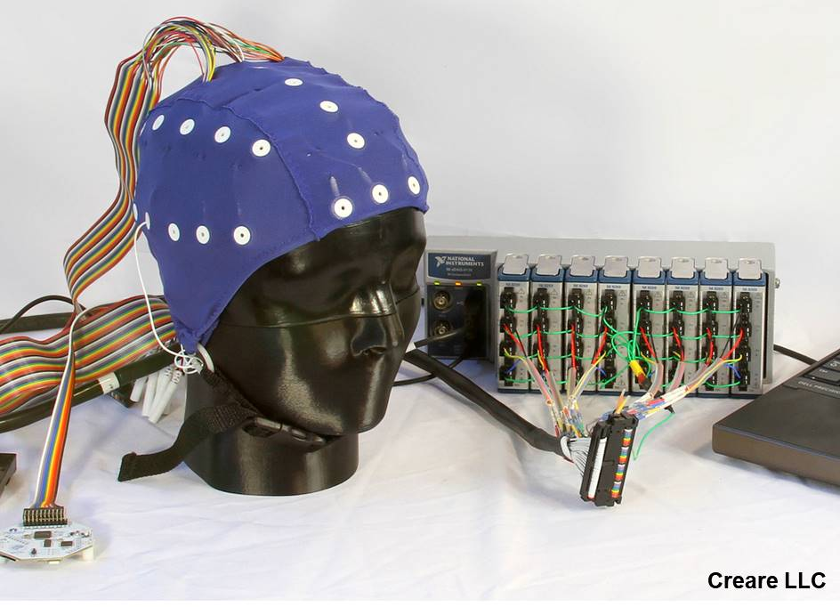

# EEG Head Phantom
How does one test EEG systems?  How does one compare the quality of EEG systems?  Ideally, you would use a human subject.  But, a human cannot produce known, repeatable EEG systems.  Without known and repeatable signals, comparing between EEG systems is very challenging.  Instead of using humans, one can use a purpose-built EEG phantom instead.  

## Technical Paper

In this paper, we present a design for a robust EEG head phantom based on conductively-doped plastic that has been injection molded into the shape of a human head. Unlike phantoms based on gelatin or saline, this design is stable and does not become fouled. The phantom is equipped with 34 drive electrodes on the inside of the head, which can be used to generate synthetic signals on the phantom surface or which can be calibrated to play back human EEG recordings. Playback fidelity for synthetic and human signals is demonstrated using an open-source EEG system (OpenBCI).

Markdown Version is [here](Technical_Paper/Head%20Phantom%20for%20EEG%20Testing.md).  PDF Version is [here](Technical_Paper/Head%20Phantom%20for%20EEG%20Testing.pdf)

