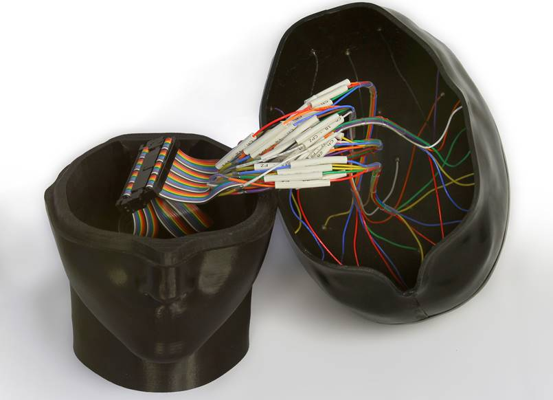
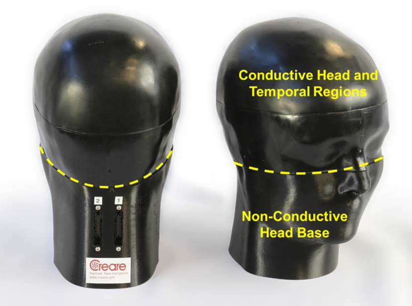
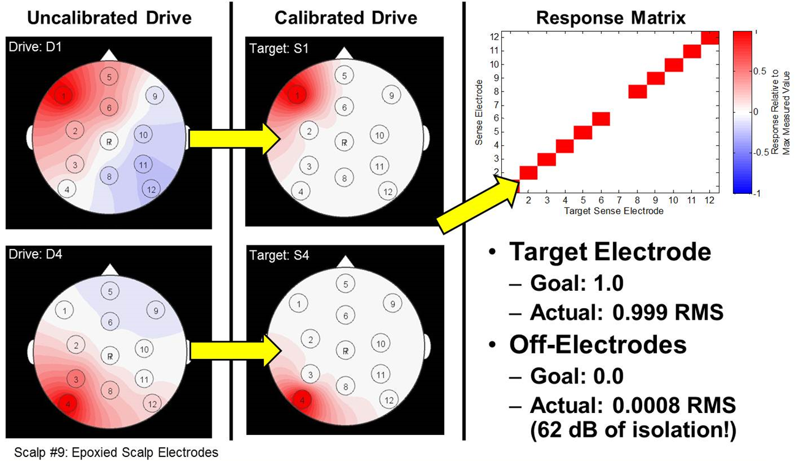
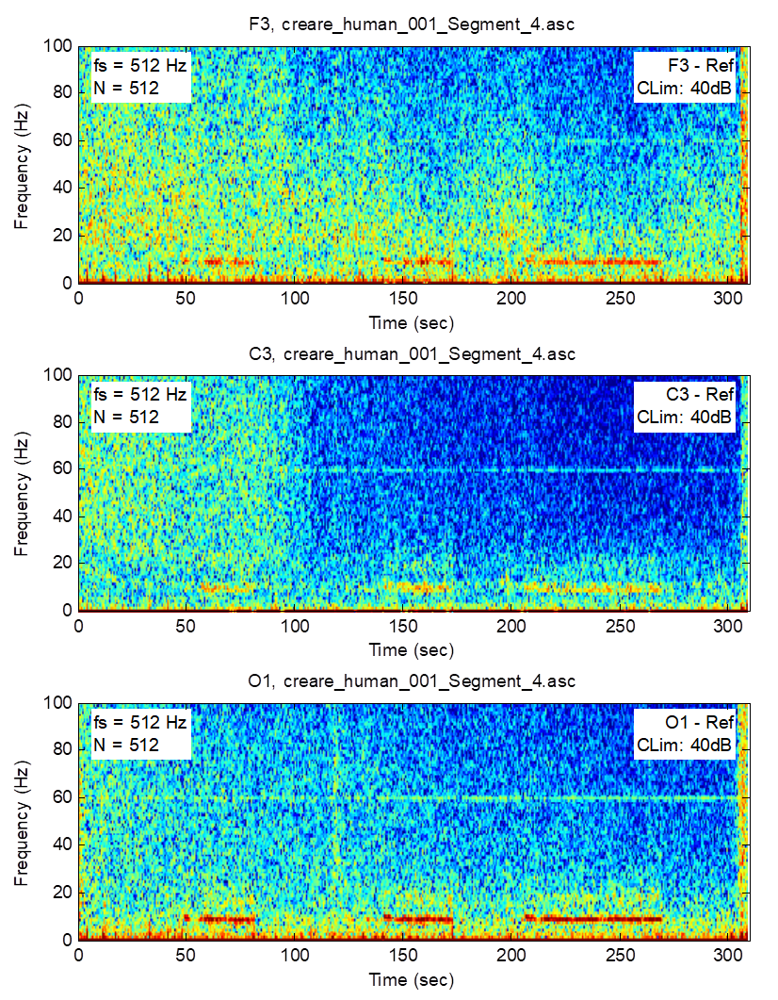
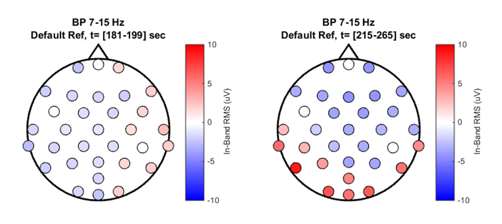
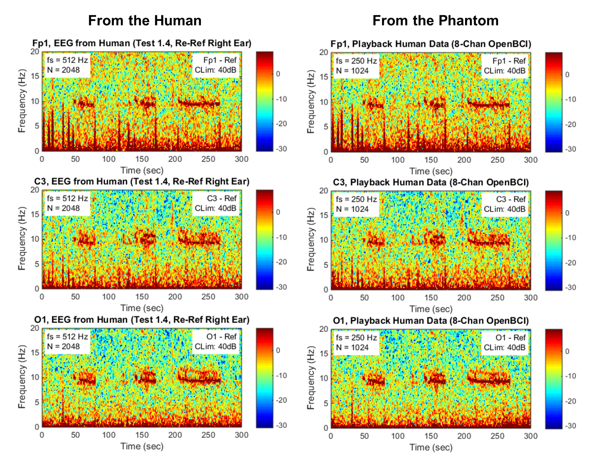

# Design and Demonstration of a Head Phantom for Testing of EEG Equipment

Authors: William E. Audette, III [1], Jerry Bieszczad [1], Lindsay V. Allen [1], Solomon G. Diamond [2], David B. Kynor [1]

Affiliation: [1] Creare LLC, Hanover, NH, USA;  [2] Dartmouth College, Hanover, NH, USA

Prepared: June 2016.  Released: March 2020.

Document ID: Creare TN-1113

## 1	ABSTRACT
Advances in neuroscience are motivating the use of electroencephalography (EEG) outside of the laboratory. There is a need, however, to validate the performance of ambulatory and low-cost EEG systems to ensure that they are suitable for the intended applications. Validation testing on humans is difficult because it is difficult to obtain repeatable signals from human subjects. Instead of using humans, EEG head phantoms can be used to produce repeatable signals by which the EEG systems could be validated. We present a design for a robust EEG head phantom based on conductively-doped plastic that has been injection molded into the shape of a human head. Unlike phantoms based on gelatin or saline, this design is stable and does not become fouled. The phantom is equipped with 34 drive electrodes on the inside of the head, which can be used to generate synthetic signals on the phantom surface or which can be calibrated to play back human EEG recordings. Playback fidelity for synthetic and human signals is demonstrated using an open-source EEG system (OpenBCI).
 

*Figure 1. EEG Head Phantom (Creare LLC) with Signal Generation System (National Instruments). The phantom is fit with a commercial EEG cap and open-source EEG electronics (OpenBCI).*

## 2	INTRODUCTION
Advances in neuroscience have enabled novel applications in medical monitoring, brain computer interfaces (BCIs), and human performance assessment. Pursuing such applications, researchers are bringing the tools of neuroscience out of the laboratory and into the real world (McDowell et al. 2013; Defense Centers of Excellence (DCOE) 2010; Doty et al. 2013). Of particular interest is EEG because it is relatively low-cost, relatively non invasive, and has high-temporal resolution. Because of these benefits, there have been many efforts to assess and optimize the performance of low-cost, portable EEG systems for use outside of the laboratory (McDowell et al. 2013; Ries et al. 2014; Hairston et al. 2014; Hairston 2012). 

A challenge with using EEG systems outside of the laboratory, however, is accuracy and repeatability. Many of the low-cost, portable EEG systems used in real-world testing have not been validated against the laboratory-grade systems whose quality is known. There is a need for a method of evaluating EEG systems in a repeatable manner. 

Currently, the performance of EEG systems is usually evaluated on human subjects. Because a test subject cannot wear multiple EEG systems simultaneously, any comparative evaluation of EEG systems requires, at best, the comparison of EEG signals recorded from the same subject at different times, or, at worst, the comparison of EEG signals recorded from different test subjects. EEG signals from human subjects, however, tend to be highly variable (Nunez and Srinivasan 2005). This greatly complicates a comparative study between EEG systems and may mask important differences in how the EEG systems perform.

### 2.1	EEG Head Phantoms
One solution to this problem would be to utilize a physical EEG head phantom in place of the human subjects. In this approach, the EEG system being tested could be placed on the head phantom in the same way it would be placed on a human subject. The head phantom would then be built so that it could produce EEG-like signals (either synthetic or as recorded from a human subject) that would be recorded by the EEG system. The key feature of the phantom is that its EEG playback would be highly repeatable, without the day-to-day or person-to-person variability exhibited by human subjects. Such a phantom could allow the signals recorded by different EEG systems to be compared in much greater detail and with much higher repeatability.

A number of physical EEG head phantoms have been discussed in the literature. A range of approaches have been used, from saline-filled, non-anatomic spheres (Cooper et al. 2010) to anatomically-shaped skulls filled with doped gelatins. In these latter cases, the anatomic skulls have been made from materials such as plastic (Yan 2014), plaster (Li et al. 2014), or even real human bone (Leahy et al. 1997). The challenge with many of these saline or gelatin-filled phantoms, however, is that they are often not built to be stable outside of the laboratory—either the phantom is not built to fully contain the saline (i.e., the head phantom is used in an inverted position so that it can contain the saline through gravity alone) or the phantom has a limited lifetime because the saline or gelatin will eventually become fouled and unusable.

### 2.2	Our Previous Head Phantom
Our goal has been to produce an EEG head phantom that is stable, repeatable, and physically robust for use outside the laboratory. As a result, our approach is to avoid liquids such as saline, because they can easily spill or leak. We also want to avoid materials that can age and become fouled such as gelatin or agar. Therefore, our previous work in this area (Collier et al. 2012) utilized carbon-doped polymers, which are robust, stable, and can be formulated to result in a range of elastic (rubber) to rigid consistencies. A photograph of this previous phantom is shown in Figure 2.

*Figure 2. Previous Generation EEG Head Phantom Utilizing Electically Conductive Doped Polymers. (Left) Photograph of the completed phantom. (Right) CT image of the head phantom, which illustrates the unintended air voids within the conductive material. The bright white pixels within the CT image are the wires and electrodes used to create the EEG-like electropotentials.*

Our phantom simulated three tissues: brain, skull, and scalp. The amount of carbon doping was controlled to create materials with electrical conductivity values approximating that of each of the three simulated tissues. While fabricating the phantom, we embedded electrodes within the brain that could be driven to create electrical potentials on the scalp. These electrodes, their wires, and the other internal structures of the phantom can be seen in the CT image cross section in Figure 2. This phantom proved to be physically robust and has been used for comparative evaluations of EEG systems (Ries et al. 2014; Lance et al. 2013).

### 2.3	Deficiencies of Previous Phantom
The primary deficiency of our previous phantom was inhomogeneity of its electrical conductivity. Some driving electrodes indicated high conductivity to the scalp while other electrodes indicated low (or no) conductivity to the scalp. Even after calibrating the playback of EEG signals through the phantom, the phantom’s electrical inhomogeneity made it very difficult to achieve spatially-realistic EEG signal patterns. 

We believe that this inhomogeneity was due to inadequate mixing of the conductive dopant within the polymer. We mixed the dopant by hand, which was challenging because the high load of dopant made the mixture be viscous like a paste, not like a liquid. Our manual mixing of the highly viscous paste also entrained air bubbles that, even after vacuum degassing, resulted in small voids that are clearly visible in the CT image of the phantom. We attempted to use advanced mechanical mixing machines, which did improve the distribution of the dopant upon visual inspection, but the resulting electrical conductivity fell far below tissue-like levels. Therefore, the proper method for doping and mixing polymers for casting electrically conductive solid phantoms is unsolved.

A second deficiency in the previous phantom was that the curing of the doped polymer resulted in a non-conductive boundary layer skin on the phantom’s scalp. As a result, when placing an EEG system onto the phantom, we would often find that the EEG electrodes had no electrical contact to the interior of the phantom. It was necessary for us to pierce the non conductive boundary layer with small metal pins so that the EEG gel used with the EEG system could be in electrical contact with the interior of the conductive material. This made the phantom difficult to set up and use.

### 2.4	Goal for New Phantom
For our latest phantom design, our goal was to continue to meet the original objective of a robust, stable, repeatable head phantom, while also making the phantom more electrically homogeneous and with a conductive boundary layer.

## 3	DESIGN AND FABRICATION
Our approach to the new phantom was to continue to use doped polymers due to their robustness and stability. Due to our difficulties with mixing (both manual and mechanical), we abandoned our approach of making our own doped mixes. Instead, as we discuss below, we identified a conductive thermoplastic that was available commercially. The primary design implication of switching to this material is that it is designed to be injection molded, which means that thick, solid shapes such as a head are not possible. To make our head phantom moldable, we needed to change our phantom design to be a hollow shell instead of a filled solid.

### 3.1	Material Selection
Moving our design from a solid to a shell means that we now only have one material, for there is no space available for different tissues. To ensure the highest homogeneity, we used a pre-doped electrically conductive polypropylene available commercially from THEMIX Plastics, Inc. (Lake Mills, WI, USA). They are a specialty compounder of electrically conductive plastics whose business is to create custom blends of plastics. From their “THE-CON 5-000” product family, they produced a conductive polymer blend targeting 350 ohm-cm, which is approximately the reported resistivity of brain and scalp tissues (Goncalves et al. 2003). This material is designed to be injection molded.

Prior to purchasing the material, THEMIX provided injection-molded sample pieces. Our measurements of these samples showed volumetric resistivity values of 10 to 20 ohm-cm, which was lower than their specified value. Because our phantom is no longer a volumetric model, however, there is no longer a strict requirement to match the volumetric conductivity of human tissues. Instead, calibration of EEG playback on the phantom would be used to ensure that it generates scalp potentials with the desired amplitude and spatial distribution.

### 3.2	Mechanical Design
The shape of the head phantom began as an anatomic model derived from MRI and CT data that were acquired from a proprietary vendor. We manipulated the model to smooth the facial features to further de-identify the data. We also forced the model to be left-right symmetric by only using half of the model and mirroring it to form the other half. The rest of the mechanical design effort was spent making the design manufacturable.

Because our doped polypropylene was designed to be injection molded, we needed to convert our head model from a solid head into a shell. We used Geomagic Studio (3D Systems, Rock Hill, SC, USA) for this conversion. We chose a thickness of 1/8 of an inch based on feedback from the injection molding service provider, ProtoLabs Inc. (Maple Plane, MN, USA). 

To further minimize cost, we designed the phantom to be fabricated using simple molds without advanced actuators or moving mechanisms. Unfortunately, an enclosed hollow head shaped shell is impossible to fabricate using a simple, non-moving, two-piece mold. As a result, we had to divide the head shell into a number of pieces (Figure 3) that could be independently molded and then joined together later to form a complete head. As can be seen, we elected to divide the head into a scalp, two side pieces, and a base.
 

*Figure 3. Multi-piece EEG Head Phantom Designed To Be Injection Molded*

For the conductive scalp component (Figure 3), we desired to make it as large as possible, while still avoiding undercuts. Therefore, we defined the bottom edge of the scalp to be as low as possible. It extends down to the plane where the head has (approximately) its maximum diameter and starts to curve back on itself. By stopping the scalp at this point, we can still utilize a low-cost, two-piece mold. We confirmed the suitability of this cut plane using the draft analysis tool in SolidWorks (Dassault Systèmes SolidWorks Corporation, Waltham, MA, USA).

The scalp alone, however, does not provide sufficient head area for many EEG tasks. Therefore, our design includes the two side pieces. The boundaries of the side pieces were also selected so that undercuts were avoided so that low-cost molds could be used. Note that the ears were removed from the model because they would have prevented the side pieces from being easily removed from the mold. Additional adjustments were made to avoid undercuts around the eyes and near the inion. Finally, we added dimples into the model at the inion, nasion, and preauricular points to provide guidance for properly placing EEG head gear.

With the head coverage provided by the scalp and side pieces, we believed that the head phantom could support most EEG tasks. Therefore, the lower part of the head could be made using non-conductive plastic, which could be formed without fabricating expensive injection molds. For the initial phantom, we designed our head base to be 3-D printed. It has ½ inch-thick walls and a 1 inch-thick bottom. 

### 3.3	Electrical Design
The purpose of the electrical components within the phantom is to create arbitrary EEG like signals that vary in time and space across the scalp of the phantom. We chose to meet this goal by embedding 34 drive electrodes into the inner surface of the conductive scalp and side pieces. We drive these electrodes using signals generated from a signal generation system from National Instruments (Austin, TX, USA). Through careful calibration of the head phantom, we can use these 34 drive electrodes to create desired EEG-like signals, including playback of real EEG data recorded from a human.

The number of electrodes in our phantom was determined by our decision to use a 32 channel signal generation system. We placed 32 drive electrodes on the inside of the phantom to approximate the positions of all of the International 10–20 system, as well as a subset of the 10–10 locations. The locations of these positions were defined on our specific head geometry obtained from the boundary element mesh of the scalp using a publicly available algorithm (Giacometti et al. 2014). We then added two more electrodes, one at the approximate location of each earlobe.

For the electrodes themselves, we utilized small button-head screws that were driven into the inside surface of the injection-molded pieces. Wires were then soldered to the head of each screw and brought out to the signal generation hardware.

The signal generation system was composed of components purchased from National Instruments. We utilized eight NI 9269 modules, each of which is a four-channel, 16-bit, digital to-analog converter (DAC) with fully isolated outputs. The modules were mounted in an NI cDAQ-9178 CompacDAQ chassis. The system was driven by software written in NI LabVIEW. The software allowed the playback of arbitrary waveforms from each channel. The arbitrary waveforms were loaded from a text file, which could be from any source, including from human EEG recordings.

The NI signal generation system has a full range output of +10 V to -10 V, which is far too strong for making EEG-like signals. Therefore, we introduced a 15 kohm in-line resistor between the DAC and each driving electrode. This resistor, along with the resistance within the phantom material, forms a voltage divider that reduces the amplitude of the voltage signals at the scalp to EEG-like levels.

### 3.4	Fabrication
The injection molds were fabricated by ProtoLabs. After sending them our conductive polymer feedstock, ProtoLabs also used the molds to fabricate our conductive scalp and conductive side pieces (Figure 4). 

*Figure 4. Injection-Molded Components. (Left) Scalp. (Right) Two side pieces.*

To join the side pieces to the scalp, we needed to select a method that would create an electrically conductive joint. We focused primarily on melting the plastic to form the joint. After numerous trials, we found best results using a specialized “plastic welder” heat gun (Laramy Products, LLC, Lyndonville, VT, USA). We used the plastic welder heat gun pointed from within the head so that the melted surfaces were not visible from outside the head. We then reinforced the weld by melting additional (non-conductive) plastic along the joint, inside of the head.

Prior to welding the pieces, we added the drive electrodes to the inside surface of the components. After welding together the scalp and side pieces, we soldered wires to each drive electrode. The electrode wires were then brought to a pair of IDC-style connectors that were mounted onto the neck of the phantom. (Figure 5). 

 
*Figure 5. Conductive and Non-Conductive Sections of Phantom, Prior to Assembly*

We mated the conductive portion of the head phantom to the non-conductive 3-D-printed base and secured the two together with screw fasteners around the perimeter. Additional epoxy could be used for a permanent connection. The final phantom is shown in Figure 6.

 
*Figure 6. Assembled Final Phantoms with the Parting Line between Conductive (top) and Non Conductive (bottom) Highlighted in Yellow.*

## 4	PRELIMINARY TESTING

### 4.1	Material Validation
When we received the injection-molded phantom components from ProtoLabs, we measured the volume resistivity of the as-molded plastic. As shown in Figure 7, we cut a rectangular sample from one of our injection-molded pieces and we attached wires using silver epoxy. We found that the use of silver epoxy made our resistance measurements more repeatable. By applying a known current between the two outermost electrodes, and by measuring the voltage as a function of distance on the inner electrodes, we saw that the as molded plastic had a volume resistivity of 14 ohm-cm. This agreed with the initial samples of the raw plastic.

*Figure 7. Rectangular Sample of Conductive Head Cap Used for Impedance Testing*

Using this same test sample (with its silver-epoxy electrodes), we then measured the resistance between pairs of electrodes using the traditional 2-wire resistance measurement technique. Regardless of which electrodes were used, the indicated resistance was approximately 1000 ohms. Because the indicated value was uncorrelated with the distance separating the electrodes, we believe that this measurement primarily exposes the surface resistance of the injection-molded plastic; in this case the surface resistance would appear to be 500 ohms per electrode. Since 500 ohms is much lower than a typical EEG electrode-to-scalp impedance value (5000 ohms), the presence of 500 ohms of surface resistance is acceptable.

### 4.2	Phantom Calibration
With the material itself validated, we then turned to confirming that the phantom is capable of being calibrated to enable the playback of a full montage of EEG-like signals. Calibration requires that we quantify the mapping from the drive electrodes inside the phantom to the sense electrodes that are part of the EEG system placed on the outside surface of the phantom. 

Our approach to calibrating the phantom was to inject a known signal at each drive electrode, one electrode at time. During the injection of each drive signal, we measured the response at each EEG sense electrode. The collection of measured responses was used to define a transfer function matrix from the drive electrodes to the sense electrodes. By inverting this matrix, we obtained a calibration matrix. This calibration matrix allows us to compute the drive signals to the phantom that are required to generate any desired EEG signals at the surface of the phantom.

For this preliminary calibration demonstration, we calibrated just the conductive scalp (not the side pieces) using a subset of 12 drive and 12 sense electrodes. Furthermore, to remove the variability associated with EEG electrodes intended for human skin, we used silver epoxy for sense electrodes, as shown in Figure 8. The locations for these electrodes were chosen to be directly above 12 of the drive electrodes that were mounted on the inner surface of the scalp. 

 
*Figure 8. Test Setup for Demonstrating Calibration of a Conductive Scalp Using National Instruments Signal Generation System and an Open-Source EEG System.*

The National Instruments signal generation system was connected to the 12 drive electrodes with the electrode under Cz (the center-top of the head) being used as the ground electrode. The 12 sense electrodes were connected to an open-source EEG system (16-channel OpenBCI V2 from OpenBCI, New York City, NY, USA), which is based on the highly integrated Texas Instruments ADS1299 analog front-end for biopotential measurements. The electrode above Cz was used as the reference electrode for the EEG recording.

To calibrate the phantom, we injected a 10 Hz sine wave into each drive electrode for 10 seconds. During each stimulation, we measured the amplitude and phase (polarity) of the signal at each sense electrode. Figure 9 shows examples of the distribution of signals that were recorded from the scalp. In the four examples, note that the strongest response is seen closest to the drive electrode, as expected. Also note, however, that all of the sense electrodes are stimulated even when only one drive electrode is activated; the phantom naturally provides a spatially smoothed, not focal response.

 
*Figure 9. Measured Responses when Calibrating the Phantom. (Left) Four examples of the spatial distribution of signals measured when driving a single drive electrode. Red is in-phase with the drive signal and blue is 180 degrees out-of-phase with the drive signal. (Top-Right) Response matrix measured from the sense electrodes when driving each of the drive electrodes. (Bottom-Right) Calibration matrix obtained by inverting the response matrix.*

The upper-right portion of Figure 9 illustrates the full transfer function matrix formed by collecting the responses from all of the stimulation periods. Note that the blank row and column for electrode 7 correspond to the ground electrode, where the drive and sense amplitudes are, by definition, zero. As this transfer function matrix is not purely diagonal, it also illustrates that the phantom provides a spatially smoothed response. By inverting the transfer function matrix, we obtain the calibration matrix shown in the lower-right of Figure 9. Using this calibration matrix, we computed a collection of drive signals that were intended to generate focal responses at each of the sense electrodes.

 
*Figure 10. Effect of Using Calibrated Drive Signals. (Left) Two examples of the effect of switching from uncalibrated drive signals to calibrated drive signals on improving the focus of the induced response. (Right) The full response matrix.  The highly diagonal response indicates that sharp focus is feasible at each of the 12 EEG sense locations.*

When we injected these calibrated drive signals into the phantom, we obtained the results shown in Figure 10. As can be seen, the responses were extremely focal, with an average of 62 dB of isolation between the targeted sense electrode and any of the other sense electrodes. This excellent result confirms that the phantom is sufficiently homogeneous to play back a nearly arbitrary spatial distribution of signals.

## 5	PLAYBACK OF HUMAN EEG DATA
Since the goal of this EEG head phantom is to play back EEG-like signals in place of a human subject, we sought to demonstrate the playback of EEG data recorded from a human. Our approach for this demonstration was to (1) record EEG signals from a human test subject using a standard research-grade EEG system, (2) place the same EEG system on the phantom and calibrate the phantom for that EEG system, and (3) drive the EEG phantom such that the human’s EEG signals are reproduced on the scalp of the phantom.

### 5.1	Collecting Human EEG Recordings
The objective of this test was to acquire representative human EEG recordings. Since one purpose of this phantom is to evaluate EEG systems outside of the laboratory, where electromagnetic interference (EMI) is often a concern, we desired to collect human EEG recordings both with and without purposely added EMI.

*Figure 10.  Our human subject volunteered to include this photo in the report.  The coil of wire in the background was used to purposely generate electromagnetic interence, though those recordings are not discussed here.*

The protocol for this human subject research was reviewed and approved by the Dartmouth Committee for the Protection of Human Subjects (CPHS) prior to conducting this study. Our signal volunteer test subject (Figure 10) was male with no known neurological conditions.

We acquired the EEG recordings using a research-grade EEG recording system (32 channel ASA-Lab from ANT North America Inc.). The EEG cap from ANT utilized wet, passive Ag/AgCl electrodes with shielded lead wires. The EEG montage (red circles, Figure 12) included the 10‒20 locations and some of the 10‒10 locations. During recording, the EEG system was configured to utilize location Fpz as its EEG ground. Being a closed proprietary system, it is unclear what “ground” means electrically for the ANT EEG electronics. The EEG system was configured to collect data at a sampling rate of 512 Hz. 
 

 
*Figure 12. The Red Circles Mark the Electrode Locations for Human and Phantom Testing with the ANT EEG. M1 and M2 are mastoid locations, in lieu of A1 and A2 on the earlobes.*

For our data collection, the subject was seated and relaxed. We recorded continuous EEG with alternating periods with the subject’s eyes open and the subject’s eyes closed. Spectrograms of the EEG data from this test are shown in Figure 14. The elevated power near 10 Hz appears to be elevated alpha rhythm power occurring during periods when the subject’s eyes were closed. Figure 14 shows the spatial distribution of measured EEG amplitude (and polarity) in the 7 to 15 Hz band for the eyes open (left) and eyes-closed (right) periods. It shows that the strength of the eyes closed alpha rhythm was highest in the occipital region, as expected.

 
*Figure 14. Spectrograms of Human EEG Recordings for the F3, C3, and O1 Electrode Positions. Elevated alpha rhythm power is present during eyes-closed periods, with the strongest amplitude in the electrodes at the back of the head (O1, bottom). Color scale spans 40 dB re: 1 uV.*
  

  
*Figure 14. Spatial Distribution of Power in the Alpha Band (7 to 15 Hz) with the Subject’s Eyes Open (left) and Eyes Closed (right). Negative RMS values indicate that the recorded signal from that location was 180 deg out-of-phase with the locations indicated with positive RMS values.*

### 5.2	Configuring The Phantom
With these recordings of human EEG, we prepared the phantom to play back the data. Our setup for this demonstration is shown in Figure 15. For the EEG system, we used an 8 channel version of OpenBCI, the open source EEG platform described earlier. We used eight discrete EEG electrodes (Ag/Ag-Cl) and attached them to the phantom with traditional EEG paste (Ten20 brand). We placed the reference electrode at the right ear location and the bias (driven ground) electrode at the left ear location.

 
*Figure 15. Setup Used for Playing Back Human EEG Data through the Phantom*

As with our preliminary testing, the first step is to calibrate the phantom for the particular EEG electrode locations being employed. We executed the same calibration procedure as described earlier. Figure 16 shows the phantom’s measured transfer function matrix and the resulting calibration matrix (again, using Moore-Penrose pseudoinverse). We then evaluated the effectiveness of the calibration by generating calibrated synthetic test signals intended to illuminate each EEG sense electrode individually. When playing these signals through the phantom, we obtained the transfer function matrix shown in Figure 17. Ideally, this would exhibit a purely diagonal response. We see that the response is excellent in the front, though more blurred in the back. On average, we achieve about 18 dB of isolation between the target electrodes and the non-target electrodes. 

 
*Figure 16. (Top) Transfer Function Matrix Measured from the Scalp Surface Using the 8-Channel OpenBCI EEG System When Individually Driving the Phantom’s Internal Electrodes. The EEG reference electrode was on the phantom’s left ear location. (Bottom) Calibration matrix resulting from computing the pseudoinverse of the transfer function matrix.*
 

 
*Figure 17. Transfer Function Matrix Measured When Evaluating the Quality of the Calibration Using Calibrated Test Tones.*

### 5.3	Playback Of Human EEG Data
We prepared the human data for playback by re-montaging the data for a right ear reference (the human data included an electrode at M2, which is very similar to the phantom’s right ear location). We then applied the calibration matrix to obtain the calibrated drive signals and played the drive signals through the phantom while recording the scalp potentials from the EEG system. Looking at Figure 18, we see that the signals recorded by the EEG system are extremely similar to re-montaged signals from the human. An additional comparison of the data is in Figure 19, which shows time-domain traces of a period that includes two eye blinks. As can be seen, the qualitative fidelity of the playback through the phantom is excellent.
 

 
*Figure 18. Spectrograms Comparing EEG Signals Recorded from the Human (left) to the Playback of the Human Signals through the Phantom (right). Color scale shows decibels re: 1 uV.*

 
*Figure 19. Example Waveforms Recorded from the Human (left) and as Played Back through the Phantom (right). Two eye blinks are seen in each recording. The quality of the playback is very good.*

## 6	SUMMARY AND CONCLUSION
Through this work, we have developed an EEG head phantom that is intended for evaluating EEG equipment outside of the laboratory. Synthetic or human EEG signals can be played back through this phantom for use in evaluating EEG systems. We demonstrated that the phantom is capable of generating realistic montages of human EEG data. Because the head phantom can produce the same EEG signals repeatedly, unlike a human, we look forward to using this new tool to examine the functionality and quality of various EEG systems.

## 7	ACKNOWLEDGEMENT
This material is based upon work supported by the U.S. Army Contracting Command–APG under Contract No. W911QX-12-C-0177. Any opinions, findings and conclusions or recommendations expressed in this material are those of the author(s) and do not necessarily reflect the views of the U.S. Army Contracting Command–APG.

## 8	REFERENCES
Collier, T. J., Kynor, D. B., Bieszczad, J., Audette, W. E., Kobylarz, E. J., Diamond, S. G., “Creation of a Human Head Phantom for Testing of Electroencephalography Equipment and Techniques,” IEEE T Biomed Eng, Vol. 59, No. 9, Sep 2012, pp. 2628–2634.

Cooper, R. J., Eames, R., Brunker, J., Enfield, L. C., Giveson, A. P., Hebden, J. C., “A Tissue Equivalent Phantom for Simultaneous Near-Infrared Optical Tomography and EEG,” Biomed Opt Express, Vol. 1, No. 2, 2010, pp. 425–430.

Defense Centers of Excellence for Psychological Health & Traumatic Brain Injury, “Portable, Field-based Devices for the Early Diagnosis of Mild Traumatic Brain Injury,” September 20, 2010.

Doty, T. J., Hariston, W. D., Kellihan, B., Canady, J., Oie, K. S., McDowell, K., “Developing a Wearable Real-World Neuroimaging System to Study Stress,” Presented at: 6th Annual International IEEE EMBS Conference on Neural Engineering, San Diego, CA, USA, Nov 6–8, 2013.

Giacometti, P., Perdue, K. L., Diamond, S. G., “Algorithm to Find High Density EEG Scalp Coordinates and Analysis of Their Correspondence to Structural and Functional Regions of the Brain,” J Neurosci Meth, Vol. 229, 2014, pp. 84–96. 

Goncalves, S. I., de Munck, J. C., Verbunt, J. P. A., Bijma, F., Heethaar, R. M., Lopes da Silva, F., et al., “In vivo Measurements of the Brain and Skull Resistivities Using an EIT-based Method and Realistic Models for the Head,” IEEE T Biomed Eng, Vol. 50, No. 6, Jun 2003.

Hairston, W. D., “Accounting for Timing Drift and Variability in Contemporary Electroencephalography (EEG) Systems,” Army Research Laboratory, ARL-TR-5945, March 2012.

Hairston, W. D., Whitaker, K. W., Ries, A. J., Vettel, J. M., Bradford, J. C., Kerick, S. E., McDowell, K., “Usability of Four Commercially-Oriented EEG Systems,” J Neural Eng,  Vol. 11, 2014, 046018.

Lance, B. J., Hairston, W. D., Apker, G., Whitaker, K. W., Slipher, G., Mrozek, R., et al., “2012 Year-End Report on Neurotechnologies for In-Vehicle Applications,” Army Research Laboratory, ARL-SR-267, June 2013. 

Leahy, R. M., Mosher, J. C., Spencer, M. E., Huang, M. X., Lewine, J., “A Study of Dipole Localization Accuracy for MEG and EEG Using a Human Skull Phantom,” Los Alamos National Laboratory, LA-UR-97-4804, November 21, 1997.

Li, J-B., Tang, C., Dai, M., Liu, G., Shi, X. T., Yang, B., et al., “A New Head Phantom with Realistic Shape and Spatially Varying Skull Resistivity Distribution,” IEEE T Biomed Eng, Vol. 61, No. 2, Feb 2014, pp. 254–263.

McDowell, K., Lin, C-T., Oie, K. S., Jung, T-P., Gordon, S., Whitaker, K. W., et al., “Real-world Neuroimaging Technologies,” IEEE Access, Vol. 1, 2013, pp. 131–149.

Nunez, P. L., Srinivasan, R., Electric Fields of the Brain: The Neurophysics of EEG, 2nd ed., Oxford University Press, New York, 2005.

Ries, A. J., Touryan, J., Vettel, J., McDowell, K., Hairston, W. D., “A Comparison of Electroencephalography Signals Acquired from Conventional and Mobile Systems,” J Neurosci Neuroeng, Vol. 3, No. 1, 2014, pp. 10–20. 

Yan, Y., “Development of a Subcortical Emphasized Physical Human Head Model for Evaluation of Deep Brain Source Contribution to Scalp EEG,” Thesis, Department of Mechanical Engineering, National University of Singapore, 2014.
